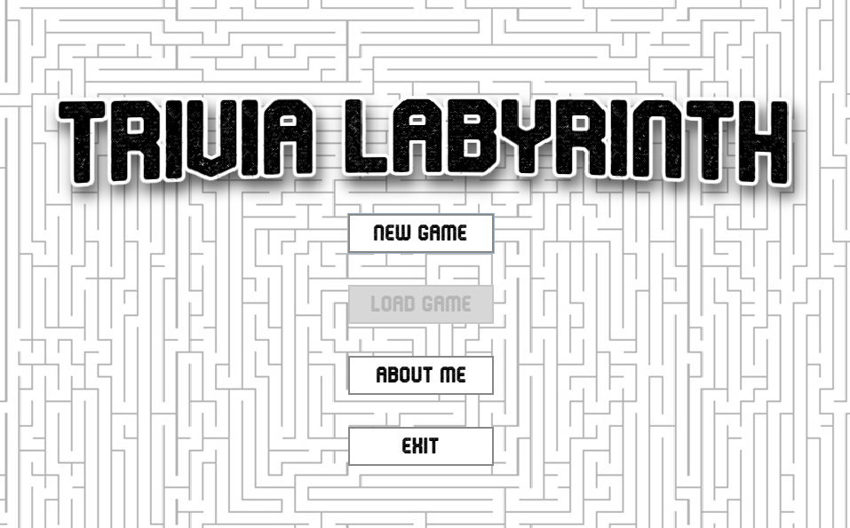

# Video-Game-Trivia-Maze-TCSS360  

**Trivia maze game, focused on video game trivia.**  
Coded in Java, pulling Q&A's from a SQLite database.  

  

---

## 📥 Installation

### 1. Download the Installer  
Click the link below to download the installer directly from the GitHub repository:  
**[Download the Game Installer](https://drive.google.com/file/d/1nZ28IGW5TZu8NZ2BpcYYZbT22tmHTxDj/view?usp=sharing)**  

### 2. System Requirements  
- **Java Development Kit (JDK)** version **20** or higher must be installed.  
- You can download the latest JDK from the [Oracle JDK Downloads page](https://www.oracle.com/java/technologies/javase-downloads.html) or [Adoptium](https://adoptium.net/).

### 3. Install the Game  
- Run the installer you downloaded from the link above.  
- Follow the on-screen instructions to complete the installation.  

### 4. Run the Game  
- After installation, launch the game using the shortcut created by the installer, or navigate to the installation folder and run the game executable.

---

## 🛠 Development Details  

- **Language**: Java  
- **Database**: SQLite  
- **Build Tool**: Inno Setup  
- **Target Java Version**: JDK 20  
